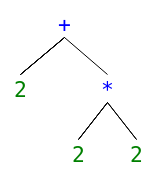
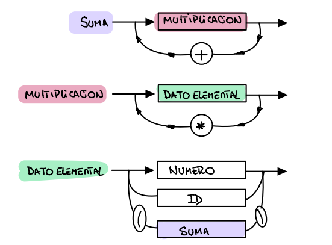

# Calculadora manual
 
Definición informal
<ul>
   - Los números posibles son todos aquellos enteros positivos </br>
   - Los identificadores serán <b>una</b> de las letras del alfabeto tanto mayúsculas como minúsculas </br>
   - Las únicas operaciones comprendidas por la calculadora serán suma (+) y multiplicación (*) </br>
   - Toda sentencia que se quiera evaluar deberá ser precedida por el operador print (@) </br>
   - La asignación se realizará con el operador asignación (=) seguido de una expresión y terminará con el operador puntoycoma (;) </br>
   - Cualquier entrada al programa deberá terminar con el operador eof (/)
   - Los parentesis estan permitidos </br>
</ul></br>
 
 
# Nivel Léxico
 
## Gramática Léxica
 
```
<token> -> uno de <t_id> <t_constNum> <t_asig> <t_sum> <t_mul> <t_eof>
<t_leftpar> <t_rightpar> <t_pyc> <t_print>
<t_id> -> [a-zA-Z]
<t_constNum> -> [0-9]
<t_asig> -> =
<t_sum> -> +
<t_mul> -> *
<t_eof> -> /
<t_leftpar> -> (
<t_rightpar> -> )
<t_print> -> @
<t_pyc> -> ;
```
 
 
| Lexema   | Token      |
| -------- | ---------- |
| [a-zA-Z] | t_id       |
| [0-9]    | t_constNum |
| =        | t_asig     |
| (        | t_leftpar  |
| )        | t_rightpar |
| +        | t_sum      |
| *        | t_mul      |
| @        | t_print    |
| ;        | t_pyc      |
| /        | t_eof      |
<br/>
 
## Analisis Lexico
El análisis léxico será realizado por el módulo scanner en este caso **scanner.c** y **scanner.h** tomando los caracteres del stdin como método de entrada. El método que expone el scanner será la función **getNextToken()** que luego la utilizara el parser para obtener los tokens (uno por cada ejecución de la función).
</br>
</br>
# Gramática Sintáctica
```
<Objetivo> ::= <programa> t_eof
<programa> ::= <listaDeSentencias>
<listaDeSentencias> ::= <sentencia> {<sentencia>}
<sentencia> ::= <asignacion> | <operacion>
<asignacion> ::= t_id t_asig <suma> t_pyc
<operacion> ::= t_print <suma>
<suma> ::= <multiplicacion> {t_sum <multiplicacion>}
<multiplicacion> ::= <datoElemental> {t_mul <datoElemental>}
<datoElemental> ::= t_constNum {t_constNum} | t_id | t_leftpar <suma> t_rightpar
```
 
El análisis sintáctico se encargará de analizar la secuencia que obtuvimos de tokens en el análisis lexico para identificar aquellas producciones válidas dentro de nuestro lenguaje.
 
Al ingresar una producción lo que hacemos en el parser es "organizarla" en una estructura de árbol que representa la estructura de la entrada. Por ejemplo:
 
### <center>"2+2*2" será representado por el siguiente árbol </center>
</br>
<center>  </center>
 
 
 
MORE INFO
 
# Análisis Semántico
 
En esta etapa lo que nos importa es poder ir computando el valor que nos arrojan las distintas ramas del árbol sintáctico que vayamos generando a medida que recorremos la producción ingresada.
 
</br></br>
 
# Técnica de análisis utilizada
La técnica utilizada para realizar el parseo es en Análisis Descendente Recursivo en donde a través de rutinas recursivas se va armando una estructura de árbol para la secuencia de entrada.
 
Siempre que tengamos un elemento no terminal se utilizará para su análisis una función que puede ser recursiva y se denomina **PAS** O procedimiento de análisis sintáctico. Estos PAS se realizarán hasta que lleguemos a elementos no terminales donde para asegurarnos que son válidos utilizaremos una función **match()** que compara el token esperado con el que tenemos realmente. </br> 
_Jorge D. Muchnik, 2010, vol 2_
 
 
 
En el caso de esta calculadora específica se puede ver claramente esta estructura descendente recursiva en los siguientes PAS
 
<center>  </center>
 
</br>
El diagrama representa tres diferentes elementos sintácticos que pueden aparecer. La diferencia entre los distintos niveles nos permite lograr la evaluación correcta con respecto al orden de evaluación, lo que nos servirá para luego en el análisis semántico computar el valor resultante.
 
_Otfried Cheong School of Computing, Data Structures Course (CS206A)_
</br></br>
 
# Manejo de identificadores
Para los identificadores se utilizó un array de 52 posiciones una por cada letra minúscula y mayúscula del abecedario. Este array se inicializa al comienzo del programa colocando cero en todas sus posiciones. Al realizar una asignación se realizan los siguientes pasos
</br></br>
<ul>
   1. Se computa el índice del identificador elegido en el array mediante la función computeSymbolIndex() </br></br>
   2.  Teniendo el índice se modifica el valor de esa posición con el valor de a asignar</br></br>
   3.  A la hora de utilizar el valor asociado a un ID se utiliza la función symbolVal() que recibe dicho ID y nos devuelve el valor de la posición asociada a él.
</ul>

